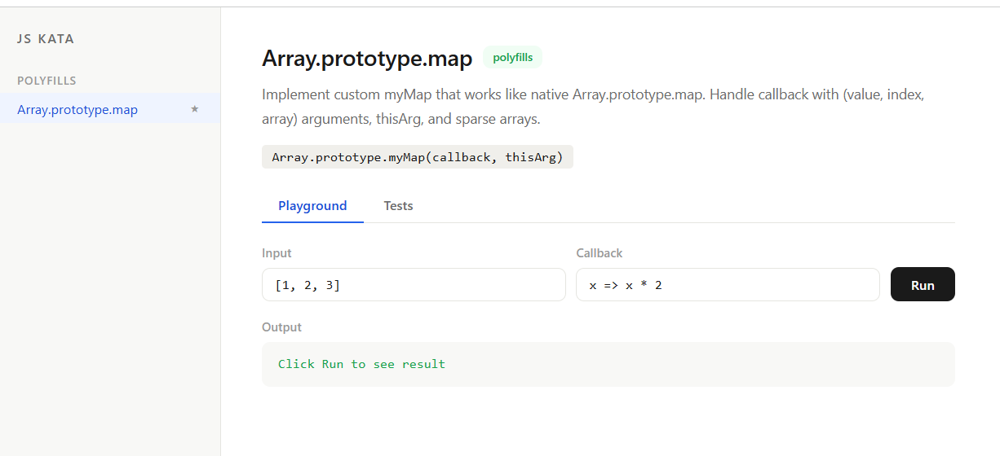

<div align="center">

# ⚡ js-kata

**JavaScript internals - handcrafted, tested, interactive.** 🧠


*Like Storybook, but for functions*

</div>

> What if Storybook and CodePen had a baby for vanilla JS?
>
> How does `.map()` actually work? I wrote it. And tested it. And built a UI for it.

A collection of JavaScript challenges to build deep understanding of the language.

> **Want to practice?** Clone the repo, add your function, write tests,
> run `npm run dev` - see results instantly in the browser.
> No config. No setup. Just code.



---

## 🚀 Getting started

```bash
git clone https://github.com/elenafrontend/js-kata.git
cd js-kata
npm install
```

**Run tests in terminal:**
```bash
npm run test:watch
```

**Launch the UI playground:**
```bash
npm run dev
```

Open `http://localhost:5173` - pick a task from the sidebar, experiment in the playground, run tests.

---

## 🎮 UI playground

Your functions deserve a UI too.

A custom-built React app:

- 🔬 **Playground** - pass arguments, see output instantly
- ✅ **Tests** - run Vitest-format tests in the browser with pass/fail indicators
- 📖 **Source** - read-only view of the solution code

<!-- TODO: replace with actual screenshot -->
<!--  -->

---

## 📂 Task categories

| Category | What's inside | Examples |
|:---------|:-------------|:--------|
| **polyfills/** | Reimplementing built-in methods from scratch | `Array.map`, `Promise.all`, `Function.bind` |
| **async/** | Async patterns and control flow | `debounce`, `throttle`, `retry`, `fetchResult` |
| **data-structures/** | Classic structures in JS | `EventEmitter`, `LRU Cache` |
| **dom/** | DOM manipulation and events | event delegation, intersection observer |
| **patterns/** | JS patterns and techniques | `curry`, `memoize`, closures |

---

## ➕ Adding a new task

Each task lives in `tasks/<category>/<task-name>/` with three files:

```
tasks/polyfills/array-filter/
├── meta.js           ← description, difficulty, default inputs
├── solution.js       ← the implementation
└── solution.test.js  ← tests in Vitest format
```

**1. Create meta:**
```js
export const meta = {
  id: 'array-filter',
  title: 'Array.prototype.filter',
  category: 'polyfills',
  difficulty: 1,
  description: 'Implement custom myFilter...',
  signature: 'Array.prototype.myFilter(callback, thisArg)',
  defaultInput: '[1, 2, 3, 4, 5]',
  defaultCallback: 'x => x > 2',
};
```

**2. Write solution:**
```js
Array.prototype.myFilter = function (callback, thisArg) {
  // your code
};

export default Array.prototype.myFilter;
```

**3. Write tests:**
```js
import './solution.js';

describe('Array.prototype.myFilter', () => {
  it('filters values with callback', () => {
    expect([1, 2, 3].myFilter(x => x > 1)).toEqual([2, 3]);
  });
});
```

**4. Register in `tasks/index.js`** - add an import and entry to the registry.

---

## 📈 Progress

| Task | Difficulty | Status |
|:-----|:----------|:-------|
| `Array.map` | ⭐ | 🔄 |
| `fetchResult` | ⭐⭐ | 🔄 |
| `Promise.all` | ⭐⭐⭐ | 🔲 |
| `Function.bind` | ⭐⭐ | 🔲 |
| `debounce` | ⭐⭐ | 🔲 |
| `throttle` | ⭐⭐ | 🔲 |
| `EventEmitter` | ⭐⭐⭐ | 🔲 |
| `curry` | ⭐⭐ | 🔲 |
| `memoize` | ⭐⭐ | 🔲 |

---

<div align="center">

Built for learning. Maintained for fun. 🧠

</div>
